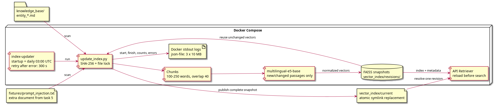

# Задание 6. Ежедневное обновление индекса

Источник — локальная папка `knowledge_base/`. Новые документы нужно сохранять как `entity_*.md`: первая строка — заголовок `# Название`, далее не менее 100 слов. Служебные `SOURCES.md` и `terms_map.json` не индексируются. Дополнительные документы берутся из `extra_documents` манифеста: тестовый документ задания 5 сохраняется в индексе.

## Как работает обновление

[update_index.py](update_index.py) сравнивает SHA-256 файлов с предыдущим манифестом. При первом запуске создаёт исходный список хешей. Если изменений нет, завершает работу без загрузки модели и записи новой версии.

Используются функция разбиения из `build_index.py` и параметры существующего индекса: 100–250 слов, перекрытие 40, модель multilingual-e5-base, префикс `passage:`, нормализация векторов. Эмбеддинги неизменённых текстов берутся из предыдущего индекса. Для новых и изменённых текстов вычисляются новые эмбеддинги. Индекс собирается из текущих документов, поэтому удалённые документы и старые версии чанков в него не попадают.

Скрипт записывает согласованный набор `faiss.index`, `chunks.jsonl`, `manifest.json` в новую папку `vector_index/revisions/<id>/`. После проверки источников и векторов атомарно переключает относительную ссылку `vector_index/current`. Файловая блокировка исключает одновременную запись двумя обновлениями. Работающий API перед поиском проверяет ссылку и загружает новую версию под блокировкой. При ошибке загрузки продолжает работать с предыдущей версией.

Первоначальный индекс должен существовать: он задаёт модель и правила разбиения. Пустая база и некорректные документы считаются ошибкой, предыдущая версия сохраняется. Смена модели требует отдельной полной переиндексации и перезапуска API. Старые версии сохраняются для отката; автоматическая очистка в учебном решении не реализована. Исходные файлы `vector_index/*.index` и метаданные в корне остаются исходной версией, актуальная версия находится через `current`.

## Запуск и расписание

Однократный запуск из корня проекта:

```bash
.venv/bin/python update_index.py --cache-folder .cache/embeddings --local-files-only
```

В [docker-compose.yml](docker-compose.yml) добавлен сервис `index-updater`. Он запускает обновление сразу при старте, затем ежедневно в **03:00 UTC — 06:00 по Москве**. После ошибки повторяет попытку через 300 секунд. После перезапуска контейнера проверяет источник заново; `restart: unless-stopped` восстанавливает сервис при сбое процесса. Пропущенные дни не воспроизводятся по отдельности: очередной запуск индексирует текущее состояние папки.

```bash
docker compose up -d --build api index-updater
docker compose logs --tail=100 index-updater
```

Кеш модели должен быть заранее заполнен, как в заданиях 3–5. Обновляющий сервис не получает ключи LLM или Telegram. Код завершения разового запуска: `0` — успех, отсутствие изменений или занятая блокировка; `1` — ошибка обновления; `2` — ошибка аргументов. Планировщик при занятой блокировке оставляет обновление уже работающему процессу и ждёт следующего дня.

Логи выводятся в stdout. JSON-события содержат UTC-время начала и завершения, количество новых эмбеддингов (`new_chunks`), итоговый размер (`index_size`), число новых, изменённых и удалённых файлов, ошибки. Между ними выводятся сообщения чтения документов. Docker хранит логи драйвером `json-file`, ротация — три файла по 10 МБ. При ошибке неизвестный итоговый размер обозначается `null`, подробности находятся в `error`.

## Проверка

[Тесты](tests/test_update_index.py) проверяют добавление, изменение, удаление, запуск без изменений, сохранение индекса при ошибке документа и отказ от повреждённой версии при подхвате API.

Интеграционная проверка с настоящей локальной E5-моделью использует временную копию базы и индекса. В неё добавляется [новый документ](fixtures/task6_new_document.md). Проверяется первое место документа в поиске по вопросу `Who coordinates the Lumen Relay Observatory?`, изменение имени координатора, удаление документа и обновление уже созданного Retriever без перезапуска. Основная база остаётся учебной базой заданий 2–5.

```bash
TASK6_REAL=1 OMP_NUM_THREADS=2 MKL_NUM_THREADS=2 \
  .venv/bin/python -m unittest tests.test_update_index -v \
  > tasks_artifacts/task6_update.log 2>&1
```

Результаты реального запуска: [лог](tasks_artifacts/task6_update.log). Архитектура и поток данных: [PlantUML](task6_architecture.puml).

При проверке новый документ получил score 0,8616 и увеличил индекс со 190 до 191 чанка; после удаления осталось 190. [Журнал запущенного планировщика](tasks_artifacts/task6_scheduler.log) подтверждает успешное обновление и следующий запуск в 03:00 UTC.


