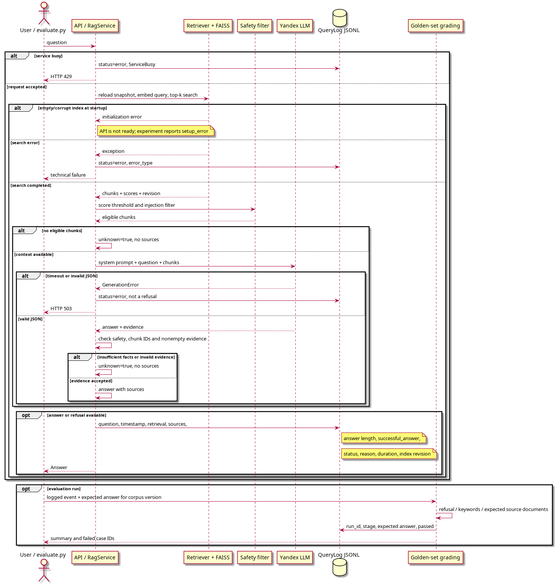

# Задание 7. Покрытие и качество базы знаний

## Эксперимент

В [golden_questions.txt](golden_questions.txt) записаны 11 вопросов в формате JSONL. Каждый содержит ожидаемый ответ, допустимые ключевые слова и документы-источники. Для версии с пробелами предусмотрены семь ответов и четыре отказа. Среди отказов — два искусственных пробела (Xarn Velgor и Void Core) и две темы, которых в базе изначально нет (десерт Kael и офисный Wi-Fi).

[evaluate.py](evaluate.py) создаёт отдельные копии базы в `runtime/task7/<run_id>/`. В копии с пробелами удаляются `entity_02.md`, `entity_32.md` и предложения с именами Xarn Velgor, Velgor, Aeron Ardyn, Aeron и Void Core в остальных документах. Скрипт проверяет отсутствие этих имён в документах и текстах чанков. Так ответ нельзя получить из оставшегося упоминания удалённой сущности. Это механическое удаление по именам, а не семантическая проверка всех косвенных связей.

Скрипт из задания 6 строит обновлённый индекс. Для исправленной версии восстанавливаются исходные документы и удалённые предложения. Дополнительно статья Quorin Jaal заменяется [уточнённой карточкой](fixtures/task7_quorin_clarification.md) по фактам из исходного `entity_17.md`: ученик Orin Valis отделён от намерения обучать Aeron Ardyn. Карточка ограничена событиями Veiled Omen; сведения о съёмках, происхождении имени и других произведениях в неё не перенесены. Затем индекс обновляется повторно. Это восстановление и уточнение проверенных сведений, а не создание новых фактов. Основная база и индекс работающего Telegram-бота не изменяются.

Во всех трёх вариантах используются одинаковые вопросы, параметры поиска и модель. В полной и восстановленной базе ожидаются девять ответов и два отказа. Смена ожиданий для двух удалённых сущностей явно задана в `unknown_in` golden set.

## Запуск

Из корня проекта с настроенной `.env` и заполненным кешем модели:

```bash
OMP_NUM_THREADS=2 MKL_NUM_THREADS=2 \
  .venv/bin/python -u evaluate.py --experiment \
  > tasks_artifacts/task7_run.log 2>&1
```

Повторная проверка конкретного индекса:

```bash
.venv/bin/python evaluate.py \
  --index-dir runtime/task7/<run_id>/gaps/vector_index --stage gaps
```

Скрипт дописывает [logs.jsonl](logs.jsonl); запуски разделены `run_id` и `stage`. [Первоначальная сводка JSON](tasks_artifacts/task7_summary.json) сохранена; отдельная проверка уточнённой версии записана в [итоговую сводку](tasks_artifacts/task7_final_summary.json). По умолчанию `--summary` заменяется последним результатом, поэтому для отдельных запусков можно указывать другой путь. Код завершения: `0` — все проверки прошли, `1` — ошибка или несовпадение с эталоном, `2` — неверные параметры. Эксперимент выполняет 33 запроса через тот же `RagService`, который использует API, с настоящими E5-эмбеддингами и настроенной Yandex LLM.

## Журнал и оценка

[QueryLog](rag_bot/query_log.py) подключён к API. В Docker журнал сохраняется на хосте в `runtime/queries.jsonl`; путь задаётся `QUERY_LOG_PATH`. Поэтому обращения через Telegram тоже журналируются, когда доходят до API. Записи API не содержат эталонных ответов — они доступны только при оценке.

В каждой записи есть вопрос, UTC-время, текст и длина ответа, статус `answered` / `unknown` / `error`, найденные фрагменты со score, допущенные к генерации ID, использованные источники, версия индекса и длительность. При ошибке сохраняется её класс, без тела HTTP-ответа и ключей. Запросы, отклонённые валидацией FastAPI до RAG, в этот журнал не попадают. Пустой или повреждённый индекс при запуске даёт ошибку инициализации, а не корректный отказ. Ошибка записи журнала выводится в журнал процесса; ответ пользователю сохраняется. Автоматическая ротация файла запросов пока не реализована.

`successful_answer` — техническая эвристика: есть ответ, источники и обоснование, флаг `unknown` выключен. Это не доказательство правильности. При оценке отдельно вычисляется `passed`: для известного ответа проверяются ключевые слова в тексте ответа, принадлежность всех цитируемых документов ожидаемому набору и отсутствие заданных ошибочных формулировок; для отказа — статус, начало «Я не знаю» и отсутствие источников. Техническая ошибка всегда проваливает проверку.

`retrieval_hit` показывает, найден ли хотя бы один ожидаемый документ в top-5. Он не проверяет, содержит ли конкретный чанк нужный факт. `unsupported_answers` считает только ответы там, где ожидался отказ; фактические ошибки в ответах на известные темы отражаются в `failed_cases`. Эталонные документы и ключевые слова дают воспроизводимую, но ограниченную оценку: возможны ложные срабатывания на отрицаниях и правильных перефразировках. Дословность цитат и полнота всех утверждений автоматически не проверяются; выводы относятся к этому набору вопросов и этому запуску.

[Диаграмма последовательности PlantUML](task7_sequence.puml):



## Наблюдаемые результаты

Выполнены 33 запроса в первоначальном эксперименте и ещё 11 после уточнения карточки Quorin Jaal. Все ответы сохранены в `logs.jsonl`. В таблице используется итоговый вариант критериев, одинаковый для всех сохранённых ответов.

| Версия базы | Документы / чанки | Верные ответы на известные вопросы | Корректные отказы | Пройдено |
|---|---:|---:|---:|---:|
| Исходная | 39 / 190 | 8/9 | 2/2 | 10/11 |
| Два искусственных пробела | 37 / 148 | 7/7 | 4/4 | 11/11 |
| Восстановлены исходные сведения | 39 / 190 | 8/9 | 2/2 | 10/11 |
| Восстановление + уточнение Quorin Jaal | 39 / 186 | 9/9 | 2/2 | 11/11 |

Счётчик документов включает тестовый документ prompt injection из задания 5. При создании пробелов удалены две статьи и предложения в 29 других статьях; дополнительных исключений из-за малого объёма не потребовалось.

Выявлены **два искусственных пробела**, **две изначально отсутствующие темы** и **одна неоднозначно изложенная связь между персонажами**. После восстановления Xarn Velgor и Void Core доля отвечаемых тем набора выросла с 7/11 до 9/11. На вопросы о десерте и Wi-Fi по-прежнему следует отказывать: подтверждённых данных для них нет.

В исходной статье Quorin Jaal рядом находились описание ученика Orin Valis и обещание обучать Aeron Ardyn. В исходной и просто восстановленной базе модель дважды назвала обоих учениками. Уточнённая карточка разделяет состоявшееся ученичество и намерение обучения. В повторной проверке модель назвала только Orin Valis. Это наблюдаемый результат одного повторного запуска, а не гарантия стабильности генерации.

При отсутствии фактов поиск всё равно находит близкие тексты. Для удалённого Xarn Velgor первым оказался Kyren Vale со score около 0,807; для Void Core — Aether Warden со score около 0,770. Оба выше порога 0,70, но не отвечают на вопросы. На вопрос о Wi-Fi первым пришёл вредоносный тестовый фрагмент со score около 0,783; его удалил защитный фильтр. Во всех этих случаях бот отказался и не выдал пользователю нерелевантные цитаты. Наличие top-5 и высокий score сами по себе не означают покрытие темы.

Первоначальный оценщик дал 33/33, потому что проверял наличие правильного имени, но пропускал лишнее неправильное имя. После ручного разбора добавлена проверка этой конкретной ошибочной формулировки. В повторном запуске проверка источников также ошибочно отклонила ответ об arcblade: документ `entity_28.md` действительно подтверждает устройство оружия и цвета клинков. После сверки с его текстом документ включён в допустимый набор. Это доработка эталона на наблюдаемых ответах; набор не является независимым тестом качества.

История не перезаписана:

- [Первоначальный эталон](tasks_artifacts/task7_golden_initial.jsonl) и [исходная сводка](tasks_artifacts/task7_summary.json).
- [Повторная оценка тех же первых 33 ответов](tasks_artifacts/task7_reassessment.json): исправлены два ложных положительных результата.
- [Эталон второго запуска](tasks_artifacts/task7_golden_refined.jsonl), [сводка второго запуска](tasks_artifacts/task7_final_summary.json) и [итоговая оценка его сохранённых ответов](tasks_artifacts/task7_final_assessment.json): исправлен один ложный отрицательный результат из-за неполного перечня источников.
- [Лог перестроения уточнённого индекса](tasks_artifacts/task7_refinement.log), [лог второго запуска](tasks_artifacts/task7_final_run.log), [проверка постоянного журнала API](tasks_artifacts/task7_api_log.json).

Повторить оценку сохранённых ответов без вызова модели:

```bash
.venv/bin/python evaluate.py --rescore \
  --run-id 20260917T221826Z-b1eaa30f \
  --summary tasks_artifacts/task7_final_assessment.json
```

Свежий `--experiment` сразу включает уточнённую карточку в восстановленную версию и использует текущий эталон. Старый дефект исходной базы может дать ненулевой код завершения всего эксперимента, даже если восстановленная версия проходит все проверки. Оценивать нужно результаты каждой версии отдельно.

## Что улучшать дальше

Для учебной базы полезно отделить факты о мире от описания съёмок, актёров и разных хронологий. В исходных статьях эти сведения смешаны; например, `entity_17.md` включал одновременно Veiled Omen и Legends. Проверенная карточка показывает один способ уточнения документа, но не заменяет проверку остального корпуса. Двух заведомо неизвестных тем недостаточно, чтобы оценить все пробелы.

Для QuantumForge следует собирать реальные вопросы сотрудников и группировать отказы по темам. В первую очередь нужны утверждённые инструкции онбординга, описания сервисов и решения частых инцидентов. У каждой страницы должны быть владелец, версия продукта и дата проверки. Частые отказы нужно превращать в задачи владельцам, а после обновления документа добавлять вопрос в эталон. Для доступа к офисной сети нужна инструкция получения доступа, а не предположение модели о пароле.

В текущем корпусе нет надёжных дат проверки фактов и версий продукта: время построения индекса не доказывает актуальность документа. Частоту реальных запросов, влияние на работу сотрудников и свежесть корпоративной базы этот небольшой искусственный набор не измеряет. Следующий шаг — отдельный набор новых вопросов, ручная проверка фактов и повторные прогоны для оценки устойчивости ответов.
